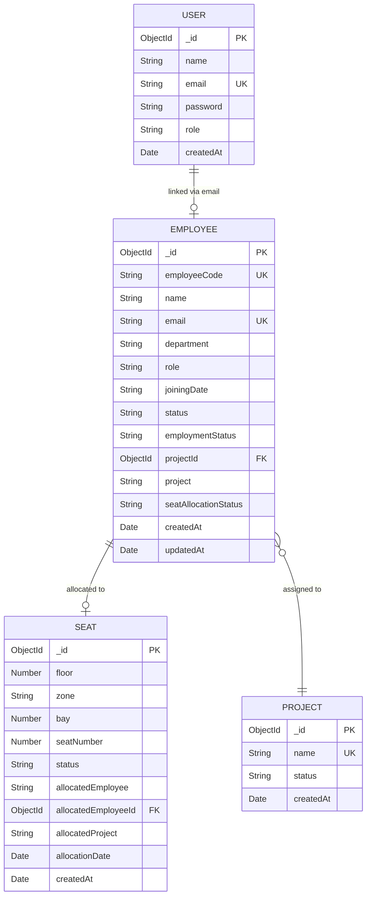

# Database Schema Documentation

## Overview
The Ethara Seat Allocation system uses **MongoDB** with **Mongoose ODM**. The database consists of 4 primary collections that manage employees, projects, seats, and user authentication.

---

## Entity Relationship Diagram



---

## Collections

### 1. Employee

Stores all employee records with their project assignment and seat allocation status.

| Field | Type | Required | Default | Constraints | Description |
|-------|------|----------|---------|-------------|-------------|
| `_id` | ObjectId | Auto | Auto | Primary Key | MongoDB auto-generated ID |
| `employeeCode` | String | ✅ | — | **Unique** | Employee identifier (e.g., `EMP-0001`) |
| `name` | String | ✅ | — | — | Full name of the employee |
| `email` | String | ✅ | — | **Unique** | Employee email address |
| `department` | String | ✅ | — | — | Department name (Engineering, HR, etc.) |
| `role` | String | ✅ | — | — | Job role (Engineer, Manager, etc.) |
| `joiningDate` | String | ✅ | — | — | Date the employee joined |
| `status` | String | ❌ | `'Active'` | — | General status flag |
| `employmentStatus` | String | ❌ | `'Active'` | — | Employment status (Active/Inactive) |
| `projectId` | ObjectId | ❌ | `null` | Ref → `Project` | Reference to the assigned project |
| `project` | String | ✅ | — | — | Project name (denormalized for queries) |
| `seatAllocationStatus` | String | ❌ | `'Pending'` | — | Seat status (Pending/Allocated) |
| `createdAt` | Date | ❌ | `Date.now` | — | Record creation timestamp |
| `updatedAt` | Date | ❌ | `Date.now` | — | Last update timestamp |

**Indexes:**
- `employeeCode`: Unique index
- `email`: Unique index

---

### 2. Project

Stores the 11 active projects that employees are assigned to.

| Field | Type | Required | Default | Constraints | Description |
|-------|------|----------|---------|-------------|-------------|
| `_id` | ObjectId | Auto | Auto | Primary Key | MongoDB auto-generated ID |
| `name` | String | ✅ | — | **Unique** | Project name (e.g., Indigo, Indreed) |
| `status` | String | ❌ | `'Active'` | — | Project status |
| `createdAt` | Date | ❌ | `Date.now` | — | Record creation timestamp |

**Indexes:**
- `name`: Unique index

**Seeded Projects:** Indigo, Indreed, Mydreed, Preed, Serfy, Oreed, bedegreed, Opreed, Serry, Kaary, Mered

---

### 3. Seat

Represents physical seats across 6 floors and 10 zones (6,600 total seats).

| Field | Type | Required | Default | Constraints | Description |
|-------|------|----------|---------|-------------|-------------|
| `_id` | ObjectId | Auto | Auto | Primary Key | MongoDB auto-generated ID |
| `floor` | Number | ✅ | — | Part of compound index | Floor number (1–6) |
| `zone` | String | ✅ | — | Part of compound index | Zone identifier (A–J) |
| `bay` | Number | ✅ | — | — | Bay number within the zone |
| `seatNumber` | Number | ✅ | — | Part of compound index | Seat number within the bay |
| `status` | String | ❌ | `'Available'` | Enum: `Available`, `Occupied`, `Reserved`, `Maintenance` | Current seat status |
| `allocatedEmployee` | String | ❌ | `null` | — | Name of allocated employee |
| `allocatedEmployeeId` | ObjectId | ❌ | `null` | Ref → `Employee` | Reference to allocated employee |
| `allocatedProject` | String | ❌ | `null` | — | Project of allocated employee |
| `allocationDate` | Date | ❌ | `null` | — | When the seat was allocated |
| `createdAt` | Date | ❌ | `Date.now` | — | Record creation timestamp |

**Indexes:**
- `{ floor, zone, seatNumber }`: **Compound unique index** — prevents duplicate seats at the same location

**Seat Status Distribution (after seeding):**
| Status | Count | Description |
|--------|-------|-------------|
| Occupied | ~4,450 | Allocated to an active employee |
| Available | ~500+ | Open for allocation |
| Reserved | ~100 | Reserved for specific purposes |
| Maintenance | ~50 | Under maintenance, not allocatable |

---

### 4. User

Stores authentication credentials for system access.

| Field | Type | Required | Default | Constraints | Description |
|-------|------|----------|---------|-------------|-------------|
| `_id` | ObjectId | Auto | Auto | Primary Key | MongoDB auto-generated ID |
| `name` | String | ✅ | — | Trimmed | User display name |
| `email` | String | ✅ | — | **Unique**, lowercase, trimmed | Login email |
| `password` | String | ✅ | — | Min length: 6 | Hashed password (bcrypt, 10 rounds) |
| `role` | String | ❌ | `'employee'` | — | User role (employee/admin) |
| `createdAt` | Date | ❌ | `Date.now` | — | Record creation timestamp |

**Indexes:**
- `email`: Unique index (lowercase, trimmed)

**Middleware:**
- `pre('save')`: Automatically hashes password using bcrypt (10 salt rounds) when password is modified
- `comparePassword()`: Instance method to verify passwords during login

---

## Relationships

```
Employee.projectId  →  Project._id       (Many-to-One)
Seat.allocatedEmployeeId  →  Employee._id (One-to-One when occupied)
```

| Relationship | Type | Description |
|-------------|------|-------------|
| Employee → Project | Many-to-One | Each employee belongs to one project. The `projectId` field references `Project._id`, and `project` stores the denormalized name for efficient querying. |
| Seat → Employee | One-to-One | Each occupied seat references exactly one employee via `allocatedEmployeeId`. An employee can have at most one allocated seat. |
| User → Employee | Implicit | Users and employees are linked by email address. No formal foreign key — the relationship is resolved at the application layer during signup. |

---

## Data Volume (Post-Seed)

| Collection | Document Count |
|-----------|---------------|
| employees | ~5,000 |
| projects | 11 |
| seats | 6,600 |
| users | 1 (admin) |
